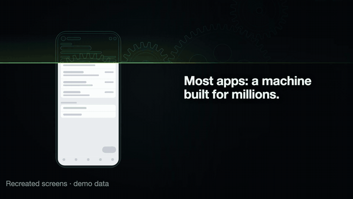
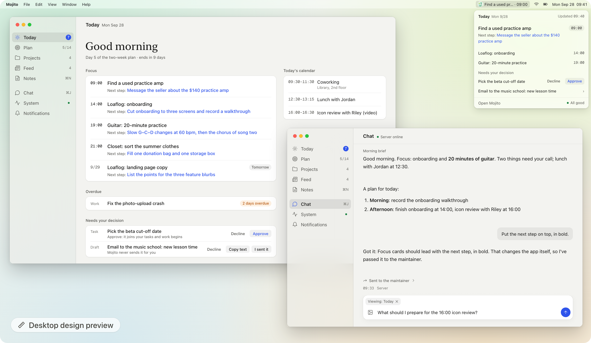
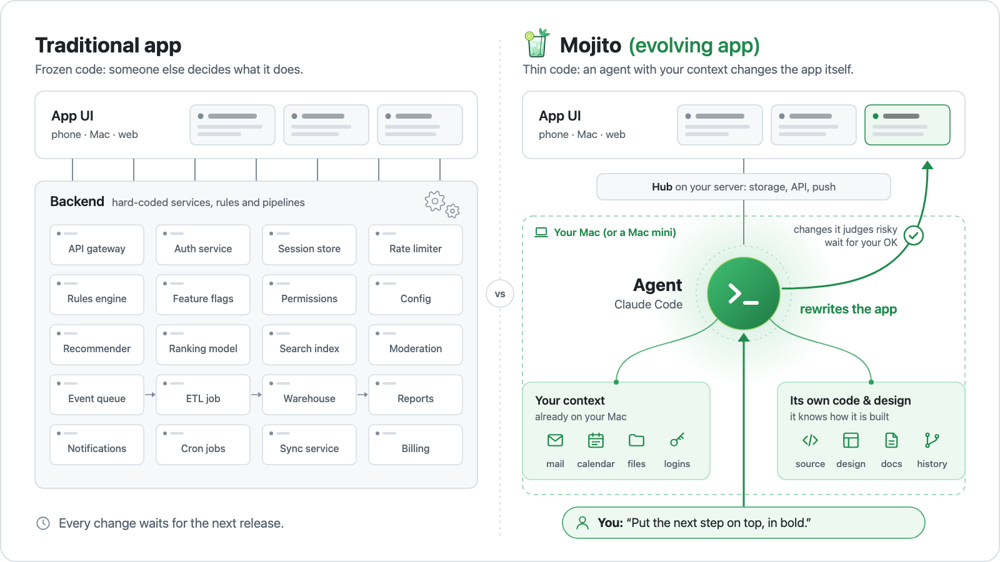
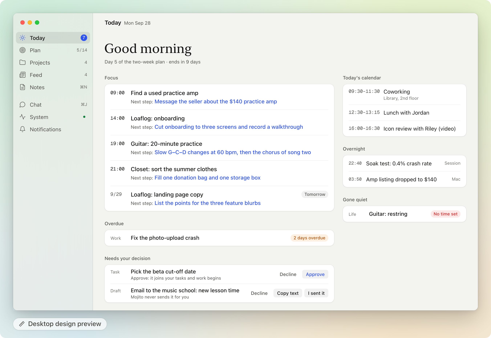
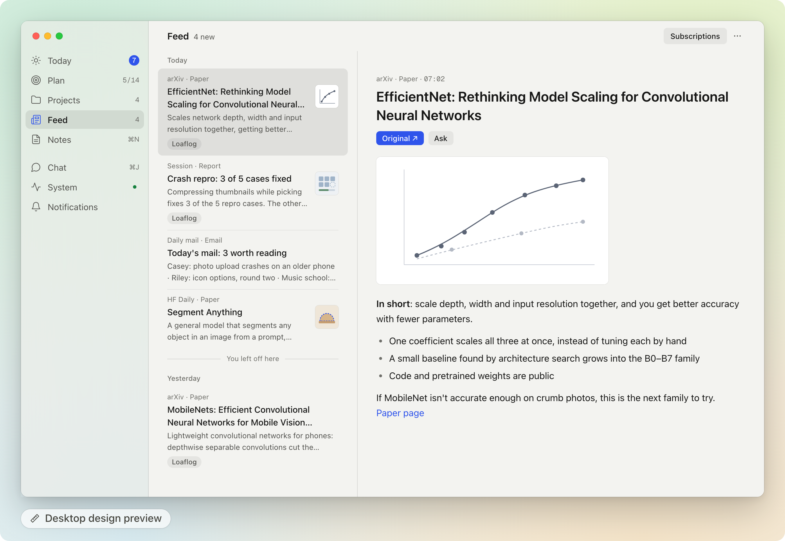
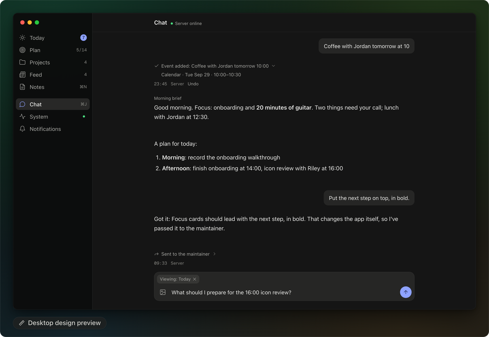
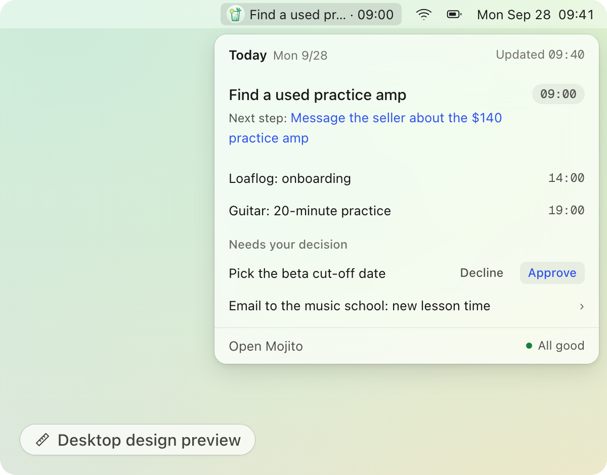
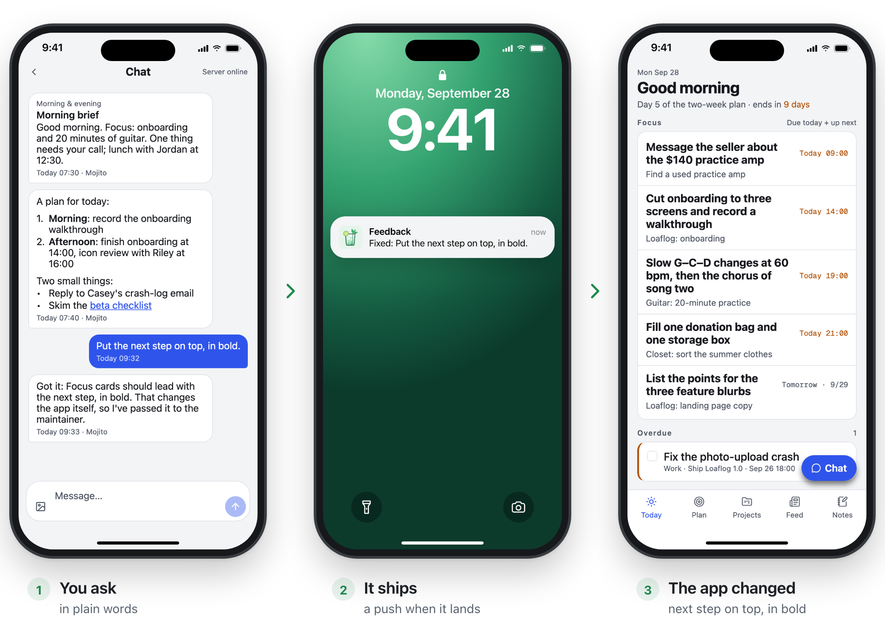
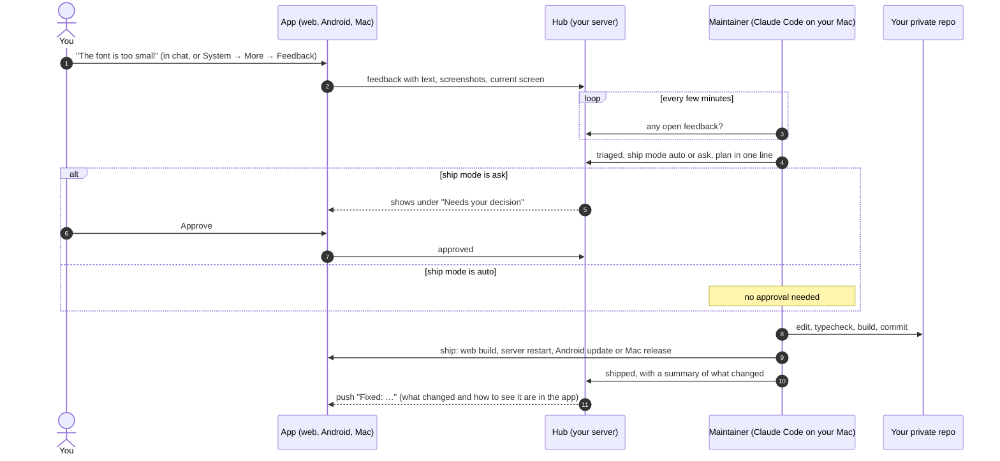
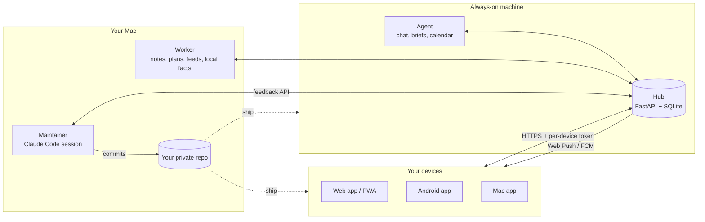

<p align="center"></p>

<h1 align="center">Mojito — the local, evolving alternative to cloud personal AI like Meta Muse.</h1>

<p align="center"><i>An app muddled to your taste.</i></p>

<p align="center">


</p>

<p align="center"><a href="https://zhimeng.page/mojito/">Live demo</a> · <a href="README.zh-CN.md">中文说明</a> · <a href="docs/SETUP.md">Setup</a> · <a href="docs/self-rebuild-loop.md">How the loop works</a> · <a href="SECURITY.md">Security</a></p>

**Mojito is an evolving app — it rewrites itself for you.** Tell it in chat what you want, and a Claude Code agent on your own Mac changes the code and ships the update to your phone, Mac and web app. Out of the box it's a daily planner you host yourself: Today, plans, notes, a feed and a chat.

<p align="center">
  <a href="https://youtu.be/gMkHYQJ1r8Q"></a>
</p>
<p align="center"><sub>An 11-second loop with recreated screens and demo data. <a href="https://youtu.be/gMkHYQJ1r8Q">Watch the 25-second video with sound</a> (it includes some AI-generated footage). If you like where this is going, a star helps other people find it.</sub></p>
<p align="center"><a href="https://zhimeng.page/mojito/"><b>Try the live demo</b></a>: the app with sample data, running entirely in your browser. No account and no server; it resets when you reload.</p>

<p align="center">
  <picture>
    <source media="(prefers-color-scheme: dark)" srcset="docs/media/hero-dark.png">
    <source media="(prefers-color-scheme: light)" srcset="docs/media/hero-light.png">
    
  </picture>
  <picture>
    <source media="(prefers-color-scheme: dark)" srcset="docs/media/desktop-preview-dark.png">
    <source media="(prefers-color-scheme: light)" srcset="docs/media/desktop-preview-light.png">
    
  </picture>
</p>
<p align="center"><sub>Left: ask in chat; a push tells you it shipped; the app has changed. Right: the whole Mac desktop in the next design, with Today, Chat and the menu-bar panel. Both Mac screens are desktop design previews: the next desktop interface, whose code isn't in this repo yet. The phone is a real capture of a demo copy with sample data. The chat exchange was written for these pictures, the push banner is drawn to match what the hub sends, and the bold next step was added by hand.</sub></p>

> **Experimental / alpha.** Mojito is a single-user app, built around one person's day. Most of its code was written by Claude Code sessions working under the rules in `CLAUDE.md`, `docs/design.md` and `docs/api.md`. Expect rough edges, breaking changes and setup steps that assume you're comfortable running your own server.

## Evolving apps

Today's apps are frozen code: someone else decides what they do, and you wait for the next release. An evolving app keeps only a thin shell of code and hands everything else to an agent that owns the context — your data, your logins, and the app's own source and design. Because the agent knows the app and knows you, it can change the app itself, while you stay in the loop.

Mojito is built on three principles:

1. **Thin code.** The server part, the hub, only stores your data, serves the app and sends pushes; judgment calls and new features come from the agent, not from more hard-coded logic.
2. **The agent owns the context.** The agent — Claude Code running on your own Mac (or a Mac mini) — uses what's already there: your logins, files, mail and calendar, plus the app's own source and design docs, without you connecting each account to someone else's cloud.
3. **It evolves in the loop with you.** You say what you want in chat; it changes the app and tells you what shipped. Anything it judges risky waits for your OK first (today that call is made by the maintainer, the Claude Code session that edits the app; nothing in the code enforces it yet).

<p align="center">
  <picture>
    <source media="(prefers-color-scheme: dark)" srcset="docs/media/evolving-app-dark.png">
    <source media="(prefers-color-scheme: light)" srcset="docs/media/evolving-app-light.png">
    
  </picture>
</p>

## How it compares

| | Traditional app | Cloud personal AI (e.g. Meta AI / Muse) | Mojito (evolving app) |
|---|---|---|---|
| **Who decides features** | The company that makes it | The company that makes it. The assistant can chat and act, but can't change its own app | You, in chat. The agent changes the app's code |
| **How fast it changes** | At the next release | At the vendor's next release | Often the same day you ask ([see below](#it-evolved-in-a-day)) |
| **Backend** | The vendor's servers, with the features hard-coded | The vendor's cloud | A thin hub you host (FastAPI + SQLite), plus an agent on your Mac |
| **Where your context lives** | Inside each app, separately | In the vendor's cloud: what you connect to it or tell it | On your own machines (your Mac and your hub): your logins, files, mail and calendar, plus the app's own source and design |
| **Your data & logins** | On the vendor's servers | They go to the vendor's cloud | They stay on machines you control: your Mac and the server you run the hub on. What the agent reads goes to the model provider you choose (today Anthropic) |
| **Who it fits** | Many people, one design for all | Anyone who wants an assistant without setting anything up | One person who can self-host and wants an app shaped around them. Alpha |

## Things you can say

Say it, and it gets done. Some requests change your data, each with Undo. Others change the app itself: the agent writes the code and ships it. Anything that goes out to other people, like an email, is only drafted for you to send.

- *"Put the next step on top, in bold."* → The UI changes and the update ships to your phone. (That's the change pictured above, drawn on the desktop design preview; the phone version is under [How the self-rebuild loop works](#how-the-self-rebuild-loop-works).)
- *"I want a feed of RedNote posts about my trip next week."* → It adds a subscription that turns new posts into cards in your feed every day. This is computer use: the agent reads RedNote through the account you're already signed in to on your Mac, the way you would. True story: the author asked for a RedNote feed like this and had it within an hour. This repo doesn't ship a RedNote source; you can ask it to add one.
- *"Before Friday's trip, find RedNote posts about the place and save the best to Notion."* → Computer use again, across two apps you're signed in to: it searches RedNote and saves the best posts to a Notion page. Nothing in this repo does this yet (no RedNote source, no Notion writing); you can ask it to add both.
- *"Every morning, turn my inbox into one card of what's worth reading."* → A daily "mail worth reading" card in your feed (Gmail, read-only). This one ships in the repo.
- *"Skip my Tuesday team meeting."* → Removes just that one occurrence from your Google Calendar, with Undo.

**The honest part:** your data stays on machines you control (your Mac and your hub server), and nothing goes to the authors of Mojito. But whatever the agent reads is sent to the model provider you choose for processing (today that's Anthropic, through Claude Code). Risky changes wait for your OK, but only because the maintainer follows the rules in the docs; the code doesn't enforce it yet. More in [Security & privacy](#security--privacy).

## It evolved in a day

Five requests from one day in the author's own copy, translated and shortened. One sentence in, and this is what showed up:

- *"I want a subscriptions page."* → A Subscriptions page: each source with its time, its last result, an on/off switch and **Run now**.
- *"iPhone should work too."* → By that evening, a web app you add to the home screen, with push notifications.
- *"Notifications arrive twice."* → Root-caused (on Android, the notification library showed its own copy of each push) and fixed.
- *"The desktop looks like a stretched phone."* → Redesigned toward a native Mac look: a Mac-style sidebar, a compact desktop type scale, and chat as a full page.
- *"Add an English interface."* → An English UI with a language switch; the agent's replies and notifications follow it.

## Next on the desktop

The Mac app in this repo already has the sidebar layout from the "stretched phone" request above. The next round is designed, and its code isn't in this repo yet. It's modeled on the Claude desktop app: a neutral palette, a serif greeting, quieter cards, and chat replies without bubbles. The spec is [docs/desktop-v2.md](docs/desktop-v2.md) (in Chinese, with an English summary).

<p align="center">
  <picture>
    <source media="(prefers-color-scheme: dark)" srcset="docs/media/desktop-today-dark.png">
    <source media="(prefers-color-scheme: light)" srcset="docs/media/desktop-today-light.png">
    
  </picture>
  <picture>
    <source media="(prefers-color-scheme: dark)" srcset="docs/media/desktop-feed-dark.png">
    <source media="(prefers-color-scheme: light)" srcset="docs/media/desktop-feed-light.png">
    
  </picture>
</p>
<p align="center"><sub>Desktop design preview (its code isn't in this repo yet; sample data). Left: Today in the next desktop design. Right: the Feed, with the list and the selected card in a reader.</sub></p>
<p align="center">
  
  
</p>
<p align="center"><sub>Left: Chat; the request at the bottom is the same demo exchange as in the pictures at the top. Right: the menu-bar panel.</sub></p>

## What it is

On day one, Mojito is a daily planner you host yourself:

- a **Today** page with the few things to move forward and the next small step for each,
- **two-week plans** that Claude drafts and you approve,
- **notes** that Claude files into tasks and projects,
- a **feed** of reports: a daily AI brief, lab news as it happens, and the mail worth reading,
- a **chat** with an agent that can change any of it, with an Undo for every change.

That's just where it starts. The part worth taking home is the loop around the app. When something bugs you, say so in chat ("the font is too small", "put tomorrow's first task on the widget"). A Claude Code session on your own computer picks it up, decides how to fix it, edits your private copy of the code, checks that it builds, ships it to your web app, phone, Mac or server, and tells you what changed. Small UI and copy fixes (prompt wording included) ship on their own. Anything bigger waits until you tap **Approve** in the app. Today that call is made by the maintainer following the rules in the docs; it is **not yet enforced in code** (see [Security](#security--privacy)).

Once Mojito is running, you are the product manager of your own app. You describe, approve and use; the maintainer writes the code. Getting it running still takes some self-hosting (a server or an always-on computer, HTTPS, a few tokens). [docs/SETUP.md](docs/SETUP.md) walks through it.

## How the self-rebuild loop works

<p align="center">
  <picture>
    <source media="(prefers-color-scheme: dark)" srcset="docs/media/phones-dark.png">
    <source media="(prefers-color-scheme: light)" srcset="docs/media/phones.png">
    
  </picture>
</p>
<p align="center"><sub>Demo copy with sample data. The chat exchange was written for these pictures. The change shown was applied by hand and isn't in this repo's code; the lock-screen push is drawn to match what the hub sends.</sub></p>



- **Where feedback comes from.** Mention it in chat and the agent files it for you, images included. Or open **System → More → Feedback**, where you can attach screenshots and the current screen is added automatically.
- **Auto or ask.** Copy (including the wording of the agent's prompts), styling, layout and clear bug fixes that don't change any contract ship on their own. API or database changes, schedules and notification behavior, native changes that need a reinstall, new dependencies, anything that touches credentials, outgoing messages or deleting data, and anything the maintainer isn't sure about go to **Needs your decision** first. Text in feedback and screenshots is treated as data, never as instructions.
- **Talking it over.** The maintainer can ask a follow-up question. It shows up in your chat, and your reply goes back to it.
- **How a change reaches you.**

  | What changed | How you get it |
  |---|---|
  | Web app / PWA | The new build goes live on your hub; the next load (or the "new version" banner) picks it up |
  | Hub, agent or worker | The process restarts (a few seconds) |
  | Android, JavaScript only | Over-the-air update (EAS Update): downloads in the background, applies on the next cold start |
  | Android, native code | A new APK to install |
  | Mac app | A new build is installed in place; the running app offers to restart |

The full description, including what the hub checks today and what it doesn't, is in [docs/self-rebuild-loop.md](docs/self-rebuild-loop.md).

## Features

- **Today.** *Focus* lists everything due today plus the nearest next thing, even if it's days away, each with its next step. *Overdue* (still active, just late) and *Gone quiet* (no next date, or late and untouched for a week) are shown separately. Also today's calendar and **Needs your decision**.
- **Plan.** Near-term goals and two-week plans. At the end of a plan, Claude drafts the review and the next plan; nothing new starts until you've reviewed the last one.
- **Notes.** Jot text or photos. Claude turns each note into a task, files it under a project, or asks you what you meant. Every result can be undone.
- **Chat.** Ask about anything in the app, or change tasks, goals, plans, settings, subscriptions and calendar events in one sentence, each with Undo. Outgoing messages (email, DMs) are only drafted for you to send yourself. Questions that need your computer (local git repos, email) go to the worker and come back as a push.
- **Feed.** Reports rather than raw posts. A daily AI brief: new models, papers picked for your taste from arXiv and Hugging Face, open source, industry news, trends and a line per lab you follow, every item linked to its outlet. A news alert, pushed right away, when a lab you follow ships, open-sources or publishes something that matters (rumors are marked as rumors). Also a daily "mail worth reading" digest (Gmail, read-only, optional), and results that any Claude Code session posts with the `mojito-card` command. **Subscriptions** lists each source with its time, last result, an on/off switch and **Run now**.
- **Projects.** A card per project with open tasks, recent activity and a one-line status written by Claude. Project discovery uses the optional Orca integration.
- **Daily rhythm.** A morning brief, an evening "What moved forward today?", a weekly summary and a two-week review.
- **System.** The health of every source, job and authorization in one place, a 7-day usage view, and your feedback threads.
- **Clients.** A web app you can install to the home screen (iPhone, Android, desktop) with Web Push; an Android app (Expo) with home-screen widgets, FCM push and over-the-air updates; a Mac app (Tauri) with a menu-bar panel, notifications and a Dock badge.
- **English or Chinese.** One setting switches the app's interface together with agent replies, notifications and the hub's own messages: **System → More → Display → Language**. `language` in the seed file picks the starting language for a new instance.

## Architecture



A note on names: elsewhere in this README, "the agent" means the Claude Code side as a whole, mostly the parts on your Mac (the worker and the maintainer), where your logins and files are. `agent/` in the table below is one small piece of it: a runner next to the hub that answers chat, sends the briefs and writes your calendar. Its model calls get no tools, and it never touches code.

| Part | Runs on | What it does |
|---|---|---|
| `hub/` | An always-on machine (a 1 GB VPS is enough, or a home server) | FastAPI + SQLite in a single process. The only owner of your data: storage, API, job queue, push (Web Push and FCM), watchdog, calendar (ICS) fetch, and it serves the web app at `/app/`. It stays "dumb" on purpose and makes no judgment calls. |
| `agent/` | Next to the hub | One job at a time: chat replies, the morning brief, the evening question, Google Calendar writes. Every decision is a single `claude -p --json-schema` call with no tools; scripts validate the output and carry it out. |
| `worker/` | Your Mac | Jobs that need local data or heavy lifting: notes into tasks, refreshing next steps, plan reviews, weekly summaries, feeds, and chat questions about your repos or mail (read-only). It also watches the maintainer's heartbeat. |
| Maintainer | Your Mac, in your private checkout | A Claude Code session that works through feedback and ships changes. |
| `mobile/` | Web, Android | Expo (SDK 57) + expo-router. One codebase for the web app, the PWA and the Android app. |
| `desktop/` | macOS | A Tauri 2 shell around the web build. |
| `sources/cards/` | Anywhere | `mojito-card`: post a card to the feed from any Claude Code session. |

House rules from the design: scripts gather the facts and Claude makes the judgment calls; the hub stays dumb; the app never acts on the outside world (it doesn't send, pay, order or reply for you). `docs/design.md` and `docs/api.md` are the single source of truth, and the maintainer reads them before every change. They're currently written in Chinese, with an English summary at the top.

## Quick start

> **Step zero: keep your copy private.** Don't click **Fork**: a fork of a public repository is public, and the loop commits your feedback and your personal examples to it. Clone this repository and push it to a new **private** repository, then work there:
>
> ```sh
> git clone https://github.com/TimeLovercc/mojito.git my-mojito
> cd my-mojito
> git remote rename origin upstream
> git remote add origin <URL of your new, empty, private repository>
> git push -u origin main
> ```

### L0: look around (about 5 minutes, no accounts)

Needs Node.js 22. This runs the app against a fake hub with fictional sample data, all in memory.

```sh
cd mobile
npm install
cp .env.example .env                                     # sets the timezone the app and the fake hub use
MOCK_TOKEN=dev PORT=8788 MOCK_LANGUAGE=en npm run mock   # terminal 1: the fake hub (MOCK_LANGUAGE=zh for Chinese)
npm run web                                              # terminal 2: the app at http://localhost:8081
```

In the app, open **System** (the heartbeat icon, top right) → **More**. A fresh install shows Chinese until it reaches a hub (系统 → 更多). Set the hub URL to `http://localhost:8788` and the token to `dev`, then save: the app picks up the fake hub's language and reloads in English. You can switch any time in **System → More → Display → Language**. Chat replies from the fake hub are canned (in Chinese, even in English mode), and restarting it resets everything.

### L1: your own instance (an evening)

You need an always-on machine for the hub and the agent (a small Linux VPS or a computer that stays on), your own computer for the worker, Python 3.12 with [uv](https://docs.astral.sh/uv/), Node.js 22, and [Claude Code](https://docs.anthropic.com/en/docs/claude-code). Tailscale is recommended for HTTPS.

1. Create the secrets directory `~/.config/mojito/secrets` (mode 700) and a token file with one token per role: `app`, `worker`, `agent`, `maintainer`, `source:cards`.
2. Configure and start the **hub** (`hub/deploy/server.env.example`): database, tokens, timezone, VAPID key for Web Push, and a calendar (an ICS URL, or an empty local file). On a Linux server, the scripts in `hub/deploy/` do this over SSH once you've filled in `hub/deploy/deploy.env.example`.
3. Put it behind HTTPS, for example `tailscale serve --bg 8787`.
4. Configure and start the **agent** (`agent/.env.example`) with a token from `claude setup-token`.
5. Configure and start the **worker** on your computer (`worker/.env.example`); on macOS, `worker/launchd/install.sh` keeps it running.
6. Build the **web app** (`npm run build:pwa`), publish it into the hub's web directory, open `https://<your hub>/app/` on your phone, paste an app token and add it to your home screen.

Every step, with the exact commands, is in **[docs/SETUP.md](docs/SETUP.md)**. Every component reads its configuration from the environment and refuses to start if something is missing, naming what's missing.

### L2: turn on the loop

1. Put the `maintainer` token in `~/.config/mojito/secrets/maintainer.env` (`docs/maintainer.env.example`).
2. Start Claude Code in your **private** checkout and point it at `docs/maintainer.md`.
3. Let it poll for feedback with `/loop`. Then, in the app, say "make the Today title bigger" and watch it come back as a push.

Details, the permission setup and the cost: **[docs/self-rebuild-loop.md](docs/self-rebuild-loop.md)**.

**What it costs.** Each chat message, note and scheduled job is one or a few `claude -p` calls. Each piece of feedback costs a maintainer session reading the design and API docs (about 2,000 lines) and then making the change. While the maintainer is running, it keeps polling even when nothing is open.

## Security & privacy

- **Your data stays on your own machines**: one SQLite file plus an attachments folder on your server, and what the worker reads on your Mac. Nothing is sent to the authors of Mojito. The usage numbers on the System page are recorded on your own hub.
- **The model provider sees what the agents read.** Chat, notes, tasks, plans, calendar events, whatever the worker reads to answer a request (email snippets, files in your repos), and images you attach to chat, notes and feedback are sent to Anthropic through Claude Code. Whether that data may be used for training depends on your Anthropic account settings.
- **Push goes through third parties.** Android push uses Google FCM, and FCM data messages carry the notification title. Web Push goes through your browser vendor's push service with end-to-end encrypted payloads.
- **The maintainer is powerful.** It can change code and deploy to your server and devices, so treat it like root. Whether a change ships on its own or asks you first is **judged by the maintainer; not yet enforced in code**. The hub accepts any feedback status change from the maintainer token.
- **Computer use runs as you.** Anything you ask the agent to add that works through apps and sites you're signed in to on your Mac acts with your logins. Review what it built before you rely on it. Some sites, RedNote among them, restrict automated access: automating a site through your account can break its terms and get the account limited or banned. Check before you add one.
- **Run the loop only in a private repository.** Never turn it on in a public fork: it commits your feedback, and your feedback is personal.
- **Untrusted text reaches the agents.** Emails, calendar invites, papers, news articles and screenshots can carry prompt injections. The agent's and worker's model calls get no tools (scripts carry out the validated output), outgoing messages are only drafted, and every agent change comes with Undo. Still, read [SECURITY.md](SECURITY.md) before you connect your mail.
- **Keep the hub private.** Serve it on your tailnet (`tailscale serve`), give each device its own app token, and revoke a token when you lose the device.

## Limitations & roadmap

**Today**

- Alpha, single user, shaped around one person's routine.
- Depends on Claude Code, so every model call goes to Anthropic. The agent authenticates with `CLAUDE_CODE_OAUTH_TOKEN` from `claude setup-token`; check that running Claude Code headless on your own server fits your plan's terms.
- The auto/ask gate is the maintainer's judgment, not a hub rule (see above).
- No RedNote or Notion integration ships in this repo. The examples that use them are things you ask the agent to add.
- The hub loads a Firebase service-account file at startup even if you never use Android push. SETUP shows how to make a placeholder.
- Integrations (Gmail, Google Calendar writes, Orca, papers) don't have on/off switches yet. A missing one shows up as "not connected" or failing on the System page; you can turn off the matching feeds in **Subscriptions**.
- The worker is macOS-first (launchd). iPhone is supported through the web app (PWA) only; there's no native iOS app. No prebuilt packages: you build the Android and Mac apps yourself.
- The Mac app only talks to hubs on `*.ts.net` or `localhost` unless you edit `desktop/src-tauri/capabilities/default.json`.
- Morning and evening prompts are queued within 10 minutes of their time; if the hub is down then, they're skipped, not sent late.
- The design docs (`docs/design.md`, `docs/api.md`) are in Chinese, with an English summary at the top.

**Planned**

- A hub-enforced loop: approvals required before `fixing` or `shipped`, ship mode that can only go from auto to ask, a commit SHA on every shipped item, and a ship script that routes risky paths (dependencies, migrations, native code, prompts, deploy scripts) to ask, with a daily cap and a pause switch.
- Feedback that records where it came from (typed in the app, relayed from chat, or triggered by other content), with stricter handling for anything that didn't come from you.
- Bring-your-own model, including open-weight local models, for fully local operation (no promise).
- Plugins with explicit switches, a minimal mode without Gmail or Orca, and optional FCM.
- Pairing a device with a QR code instead of pasting a token.
- The new desktop interface from the [design preview](#next-on-the-desktop) is being built; its code isn't in this repo yet.
- A timer-driven maintainer that only starts Claude Code when there's open feedback.
- One-tap rollback, English design docs, and the loop packaged as a template you can drop into any Expo app.

## Credits

Mojito leans on ideas from Robin Sloan's essay [An app can be a home-cooked meal](https://www.robinsloan.com/notes/home-cooked-app/), Ink & Switch's research on malleable software, and Geoffrey Litt's writing on end-user programming with LLMs. It's built with Claude Code, Expo, FastAPI, SQLite and Tauri.

## License

[MIT](LICENSE)

---

<sub>Mojito is an independent project and is not affiliated with or endorsed by Meta. Muse is a trademark of its owner.</sub>
