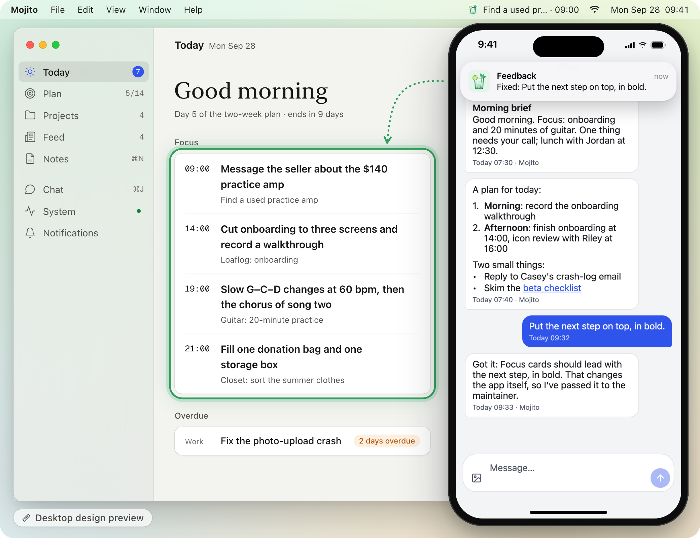
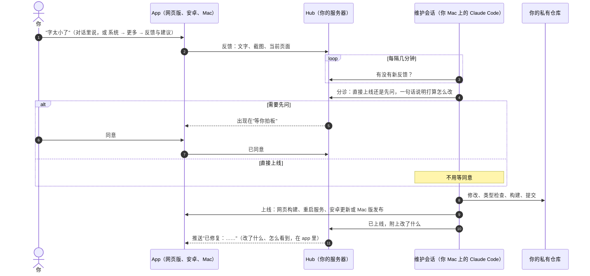
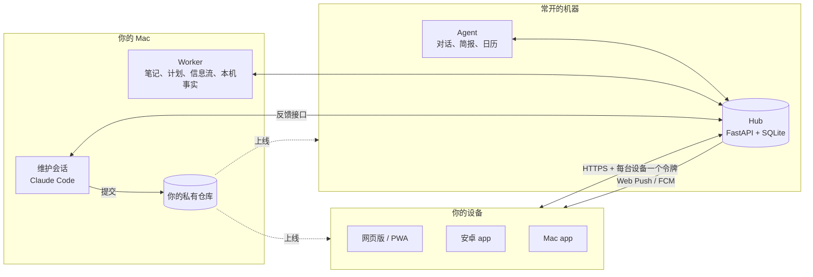

<p align="center"></p>

<h1 align="center">Mojito——本地的、会进化的 app，Meta Muse 这类云端个人 AI 的替代品。</h1>

<p align="center"><i>一杯按你口味现调的 app。</i></p>

<p align="center">


</p>

<p align="center"><a href="README.md">English</a> · <a href="docs/SETUP.md">部署指南（英文）</a> · <a href="docs/self-rebuild-loop.md">回路怎么工作（英文）</a> · <a href="SECURITY.md">安全说明（英文）</a></p>

**Mojito 是一个会进化的 app：它会照你的意思改写自己。** 在对话里说你想要什么，你自己 Mac 上的 Claude Code agent 就会改代码，把更新发到你的手机、Mac 和网页版。装好时，它是一个你自己托管的每日计划 app：今天页、计划、笔记、信息流和对话。

<p align="center">
  <a href="https://youtu.be/gMkHYQJ1r8Q"></a>
</p>
<p align="center"><sub>11 秒循环动图，界面为演示数据重现。<a href="https://youtu.be/gMkHYQJ1r8Q">看 25 秒带声音的完整视频</a>（部分画面由 AI 生成）。如果你喜欢这个方向，点个 star 能让更多人看到它。</sub></p>

<p align="center">
  <picture>
    <source media="(prefers-color-scheme: dark)" srcset="docs/media/hero-dark.png">
    <source media="(prefers-color-scheme: light)" srcset="docs/media/hero-light.png">
    
  </picture>
</p>
<p align="center"><sub>在对话里提，推送告诉你上线了，app 就变了。左边的 Mac 窗口是桌面版设计稿（Desktop design preview），也就是下一版桌面界面，代码还没进本仓库。右边手机是演示副本的真实截图，示例数据；对话里那一问一答是为这组图写的，推送横幅按 hub 实际发出的内容绘制，"下一步在上、加粗"是手工加的改动。</sub></p>

<p align="center">
  <picture>
    <source media="(prefers-color-scheme: dark)" srcset="docs/media/desktop-preview-dark.png">
    <source media="(prefers-color-scheme: light)" srcset="docs/media/desktop-preview-light.png">
    
  </picture>
</p>
<p align="center"><sub>桌面版设计稿（Desktop design preview）：重设计进行中，代码还没进本仓库。示例数据。</sub></p>

> **实验性 / alpha。** Mojito 是围着一个人的日常长出来的单用户 app，代码大多由 Claude Code 会话按 `CLAUDE.md`、`docs/design.md` 和 `docs/api.md` 里的规则写成。会有毛刺，会有不兼容的改动，部署步骤也默认你会自己管服务器。

## 会进化的 app

今天的 app 都是写死的代码：功能由别人决定，你只能等下一次更新。会进化的 app 只保留一层很薄的代码，其余交给一个掌握全部上下文的 agent——你的数据、你的登录态，还有这个 app 自己的源代码和设计。它既懂这个 app，也懂你，所以能自己改自己；拍板的始终是你。

Mojito 按三条原则来做：

1. **代码要薄。** 服务器上的 hub 只管存你的数据、提供 app、发推送。判断和新功能都来自 agent，而不是往代码里再写死更多逻辑。
2. **上下文在 agent 手里。** agent（跑在你自己 Mac 或 Mac mini 上的 Claude Code）直接用那里已有的东西：登录态、文件、邮件、日历，还有这个 app 自己的源代码和设计文档。不用把每个账号都接到别人的云上。
3. **和你一起进化。** 你在对话里说想要什么，它改好 app，告诉你上线了什么。它觉得有风险的改动，会先等你点头（目前由维护会话判断，也就是负责改 app 的那个 Claude Code 会话；代码里还没有强制）。

<p align="center">
  <picture>
    <source media="(prefers-color-scheme: dark)" srcset="docs/media/evolving-app-dark.png">
    <source media="(prefers-color-scheme: light)" srcset="docs/media/evolving-app-light.png">
    
  </picture>
</p>

## 对比一下

| | 传统 app | 云端个人 AI（如 Meta AI / Muse） | Mojito（会进化的 app） |
|---|---|---|---|
| **谁决定功能** | 做它的公司 | 做它的公司。助手能聊天、能办事，但改不了自己的 app | 你，在对话里说。agent 去改 app 的代码 |
| **改得多快** | 等下一个版本 | 等厂商的下一个版本 | 常常当天就改好（[见下文](#一天里的进化)） |
| **后端** | 厂商的服务器，功能写死在里面 | 厂商的云 | 你自己托管的一层薄 hub（FastAPI + SQLite），加上你 Mac 上的 agent |
| **上下文在哪** | 各个 app 里，各管各的 | 厂商的云里：你接给它的、跟它说过的 | 你自己的机器上（你的 Mac 和你的 hub）：登录态、文件、邮件、日历，还有 app 自己的源代码和设计 |
| **你的数据和登录** | 在厂商的服务器上 | 交到厂商的云上 | 留在你自己掌控的机器上：你的 Mac 和跑 hub 的服务器。agent 读到的内容会发给你选的模型提供方（目前是 Anthropic） |
| **适合谁** | 很多人，一套设计给所有人 | 想要个助手、又不想折腾配置的人 | 单个用户：会自己托管，想要一个照着自己长的 app。目前是 alpha |

## 你可以这样说

说一句，事情就办了。有的请求改的是你的数据，每次都能撤销；有的改的是 app 本身，agent 写好代码并上线。发给别人的东西（比如邮件）只起草，由你自己发。

- *"把下一步放到最上面，加粗。"* → 界面改好，更新推到你手机上。（上面图里就是这个改动，画在桌面版设计稿上；手机上的样子见[自我重建回路怎么工作](#自我重建回路怎么工作)。）
- *"我想要一个信息流，看看小红书上关于我下周旅行的帖子。"* → 它加一个订阅，每天把新帖子变成信息流里的卡片。这是 computer use：agent 用你 Mac 上已经登录的小红书账号去看，跟你自己看一样。真事：作者要过一个这样的小红书信息流，不到一小时就做好了。这个仓库不自带小红书数据源，你可以让它加一个。
- *"周五出发前，在小红书上找找那个地方的帖子，把最好的几篇存到 Notion。"* → 还是 computer use，这次跨两个你已登录的 app：在小红书上搜，把最好的几篇存进一个 Notion 页面。这个仓库里还没有这些（不自带小红书数据源，也还不能写入 Notion），你可以让它加上。
- *"每天早上把我的收件箱整理成一张卡，只留值得看的。"* → 信息流里每天一张"值得看的邮件"（Gmail，只读）。这个仓库里自带。
- *"这周二的周会不去了。"* → 只从你的 Google 日历里删掉这一次，可以撤销。

**实话实说**：数据都在你自己掌控的机器上（你的 Mac 和跑 hub 的服务器），不会发给 Mojito 的作者。但 agent 读到的内容，会交给你选的模型提供方处理（目前是经 Claude Code 发给 Anthropic）。有风险的改动会先等你点头，但这靠的是维护会话遵守文档里的规则，代码里还没有强制。详见[安全与隐私](#安全与隐私)。

## 一天里的进化

作者自己那份副本里，某一天的五个请求，原话略有缩写。每次一句话，换来的是这些：

- *"我想要一个订阅页。"* → 一个订阅页：每个来源写着时间和上次的结果，有开关，还有**现在跑**。
- *"iPhone 也要能用。"* → 当天晚上，就有了能加到主屏的网页版，带推送通知。
- *"通知来了两遍。"* → 找到了根因（在安卓上，通知库把每条推送又自己显示了一份），修好了。
- *"桌面版看着像拉宽的手机。"* → 往原生 Mac 的样子重新设计：Mac 风格的侧边栏、更紧凑的桌面字号，对话改成整页。
- *"加一个英文界面。"* → 英文界面，加一个语言切换；agent 的回复和通知也跟着切。

## 桌面版下一步

仓库里的 Mac 版，已经是上面"拉宽的手机"那条请求换来的侧边栏布局。下一版已经设计好，代码还没进本仓库。它学的是 Claude 桌面版：中性配色、衬线大字问候、更安静的卡片，AI 的回复不套气泡。规范见 [docs/desktop-v2.md](docs/desktop-v2.md)（中文，开头有英文摘要）。

<p align="center">
  <picture>
    <source media="(prefers-color-scheme: dark)" srcset="docs/media/desktop-today-dark.png">
    <source media="(prefers-color-scheme: light)" srcset="docs/media/desktop-today-light.png">
    
  </picture>
</p>
<p align="center"><sub>桌面版设计稿（Desktop design preview）：下一版桌面界面里的今天页，代码还没进本仓库。示例数据。</sub></p>

<details>
<summary>更多桌面版设计稿：对话、信息流、菜单栏面板</summary>
<br>
<p align="center"></p>
<p align="center"><sub>对话。最下面那条请求，和首图里是同一段演示对话。</sub></p>
<p align="center">
  <picture>
    <source media="(prefers-color-scheme: dark)" srcset="docs/media/desktop-feed-dark.png">
    <source media="(prefers-color-scheme: light)" srcset="docs/media/desktop-feed-light.png">
    
  </picture>
</p>
<p align="center"><sub>信息流：左边是列表，右边阅读选中的卡片。</sub></p>
<p align="center"></p>
<p align="center"><sub>菜单栏面板。</sub></p>
</details>

## 它是什么

装好的第一天，Mojito 是一个自己托管的每日计划 app：

- **今天**页：列出该推进的几件事，每件都写着下一小步；
- **两周计划**：Claude 起草，你来批准；
- **笔记**：由 Claude 整理成事项、归到项目；
- **信息流**：按你的口味挑的论文和邮件；
- **对话**：里面的 agent 能改上面任何一样，每次改动都能撤销。

这只是起点。真正值得带走的，是 app 外面那个回路。哪里用着不顺手，就在对话里说（"字太小了""把明天第一件事放到小组件上"）。你自己电脑上的 Claude Code 会话会接过去，判断怎么改，在你的私有副本里改代码，确认能构建，再发布到网页版、手机、Mac 或服务器，最后告诉你改了什么。界面和文案（包括提示词措辞）的小修小改直接上线；更大的改动，要等你在 app 里点**同意**。这个判断目前由维护会话按文档规则做出，**代码里还没有强制**（见[安全与隐私](#安全与隐私)）。

Mojito 跑起来以后，你就是自己这个 app 的产品经理：提需求、拍板、使用，代码交给维护会话去写。不过要跑起来，还得自己托管一下（一台服务器或常开的电脑、HTTPS、几个令牌），[docs/SETUP.md](docs/SETUP.md)（英文）会一步步带你做完。

## 自我重建回路怎么工作

<p align="center">
  <picture>
    <source media="(prefers-color-scheme: dark)" srcset="docs/media/phones-dark.png">
    <source media="(prefers-color-scheme: light)" srcset="docs/media/phones.png">
    
  </picture>
</p>
<p align="center"><sub>演示副本，示例数据。对话里那一问一答是为这组图写的。图中的改动是手工加上的，本仓库代码里没有；锁屏推送是照 hub 实际发出的内容画的。</sub></p>



- **反馈从哪来**：在对话里提一句，agent 会替你提交，图片也一起带上。也可以在**系统 → 更多 → 反馈与建议**里写，能附截图，当前页面会自动带上。
- **直接上线还是先问**：文案（包括 agent 提示词的措辞）、样式、布局，以及不改任何约定的明确 bug 修复，直接上线。改接口或数据库、改定时和通知行为、需要重装的原生改动、新增依赖、涉及凭据、对外发送或删除数据的，以及维护会话拿不准的，都先进**等你拍板**。反馈和截图里的文字只当数据，不当指令。
- **可以来回商量**：维护会话可以追问你。问题会出现在你的对话里，你的回复会转回给它。
- **改动怎么到你手上**：

  | 改了什么 | 怎么拿到 |
  |---|---|
  | 网页版 / PWA | 新构建在你的 hub 上生效；下次打开（或点"有新版本"提示）就是新的 |
  | hub、agent 或 worker | 进程重启，几秒钟 |
  | 安卓，只改了 JavaScript | 空中更新（EAS Update）：后台下载，下次冷启动生效 |
  | 安卓，改了原生代码 | 装新的 APK |
  | Mac 版 | 新版原地装好，正在运行的 app 会提示你重启 |

完整说明（包括 hub 现在校验什么、不校验什么）见 [docs/self-rebuild-loop.md](docs/self-rebuild-loop.md)（英文）。

## 功能

- **今天**：*今日重点*列出今天到期的全部事项，再加上最近的下一件（哪怕在几天后），每条都有下一步。*逾期*（还在做，只是晚了）和*被忘了*（没有下一个日期，或逾期后一周没动）分开显示。还有今天的日程和**等你拍板**。
- **计划**：近期目标和两周计划。一期结束时，Claude 起草复盘和下一期计划；上一期没复盘，新一期就不开始。
- **笔记**：文字或照片随手记。Claude 会把每条整理成事项、归到项目，或者回头问你是什么意思。每个结果都能撤销。
- **对话**：问 app 里的任何事，或者一句话改事项、目标、计划、设置、订阅和日程，每次改动都能撤销。对外的消息（邮件、私信）只起草，由你自己发。需要你电脑上数据的问题（本地 git 仓库、邮件）会转给 worker，结果以推送回来。
- **信息流**：一张张卡片，有按你的口味挑出的 arXiv 和 Hugging Face 新论文，每天一张"值得看的邮件"（Gmail 只读，可选），还有任何 Claude Code 会话用 `mojito-card` 命令发来的结果。**订阅**页列出每个来源的时间、上次结果、开关和**现在跑**。
- **项目**：每个项目一张卡，写着未完成的事项、最近动态和 Claude 写的一句话现状。发现项目要用可选的 Orca 集成。
- **每日节奏**：早上一份简报，晚上问一句"今天推进了什么？"，每周一份总结，每两周一次复盘。
- **系统**：每个数据源、任务和授权的健康状况集中在一处，还有 7 天使用情况和你的反馈讨论。
- **客户端**：能装到主屏的网页版（iPhone、安卓、电脑都行），支持 Web Push；安卓 app（Expo），有桌面小组件、FCM 推送和空中更新；Mac app（Tauri），有菜单栏面板、通知和 Dock 角标。
- **中文或英文**：一个设置同时切换 app 界面、agent 的回复、通知和 hub 自己的文字，在**系统 → 更多 → 显示 → 语言**里改。新实例的初始语言由种子文件里的 `language` 决定。

## 架构



关于名字：本文其他地方说的 agent，指整个 Claude Code 这一侧，主要是你 Mac 上的部分（worker 和维护会话），你的登录态和文件都在那里。下表里的 `agent/` 只是其中一小块：跑在 hub 旁边，负责回复对话、发简报、写日历；它调模型时不带工具，也从不碰代码。

| 部分 | 跑在哪 | 做什么 |
|---|---|---|
| `hub/` | 常开的机器（1 GB 内存的 VPS 就够，或家里的服务器） | FastAPI + SQLite，单进程。你数据的唯一主人：存储、API、任务队列、推送（Web Push 和 FCM）、看门狗、拉取日历（ICS），并在 `/app/` 下提供网页版。刻意保持"笨"，不做判断。 |
| `agent/` | 和 hub 在一起 | 一次一个任务：回复对话、早上简报、晚上提问、写 Google 日历。每次判断都是一次不带工具的 `claude -p --json-schema` 调用，由脚本校验输出再执行。 |
| `worker/` | 你的 Mac | 需要本机数据或比较重的活：笔记整理成事项、刷新下一步、计划复盘、每周总结、信息流，以及对话里关于你的仓库或邮件的问题（只读）。它也盯着维护会话的心跳。 |
| 维护会话 | 你的 Mac，在你的私有副本里 | 一个 Claude Code 会话，处理反馈、发布改动。 |
| `mobile/` | 网页、安卓 | Expo（SDK 57）+ expo-router，一套代码出网页版、PWA 和安卓 app。 |
| `desktop/` | macOS | 包着网页构建的 Tauri 2 外壳。 |
| `sources/cards/` | 任何地方 | `mojito-card`：从任意 Claude Code 会话往信息流发卡片。 |

设计上的几条规矩：事实靠脚本查，判断交给 Claude；hub 保持笨；app 不替你对外做任何事（不发送、不付款、不下单、不回复）。`docs/design.md` 和 `docs/api.md` 是唯一权威，维护会话每次改动前都会先读。这两份目前是中文写的，开头有英文摘要。

## 快速开始

> **第零步：你的副本要保持私有。** 不要点 **Fork**：公开仓库的 fork 也是公开的，而回路会把你的反馈和个人例子写进提交。先 clone 本仓库，再推到你新建的**私有**仓库，之后都在那里干活：
>
> ```sh
> git clone https://github.com/TimeLovercc/mojito.git my-mojito
> cd my-mojito
> git remote rename origin upstream
> git remote add origin <你新建的空私有仓库地址>
> git push -u origin main
> ```

### L0：先看看（约 5 分钟，不需要任何账号）

需要 Node.js 22。app 连一个假的 hub，里面是虚构的示例数据，全部只在内存里。

```sh
cd mobile
npm install
cp .env.example .env                                     # 设置 app 和假 hub 用的时区
MOCK_TOKEN=dev PORT=8788 MOCK_LANGUAGE=zh npm run mock   # 终端 1：假 hub（想看英文用 MOCK_LANGUAGE=en）
npm run web                                              # 终端 2：app 在 http://localhost:8081
```

在 app 里打开**系统**（右上角的心跳图标）→ **更多**。hub 地址填 `http://localhost:8788`，令牌填 `dev`，保存：app 会读到假 hub 的语言（和当前不同时会重新加载）。之后随时可以在**系统 → 更多 → 显示 → 语言**里切换。假 hub 的对话回复是写死的中文，重启就回到初始数据。

### L1：你自己的实例（一个晚上）

需要：一台常开的机器跑 hub 和 agent（小的 Linux VPS，或一台不关机的电脑），你自己的电脑跑 worker，Python 3.12 和 [uv](https://docs.astral.sh/uv/)，Node.js 22，[Claude Code](https://docs.anthropic.com/en/docs/claude-code)。HTTPS 推荐用 Tailscale。

1. 建密钥目录 `~/.config/mojito/secrets`（权限 700），再建一个令牌文件，每个角色一个令牌：`app`、`worker`、`agent`、`maintainer`、`source:cards`。
2. 配置并启动 **hub**（`hub/deploy/server.env.example`）：数据库、令牌、时区、Web Push 用的 VAPID 密钥、日历（ICS 链接，或一个空的本地文件）。用 Linux 服务器的话，填好 `hub/deploy/deploy.env.example` 后，`hub/deploy/` 里的脚本会通过 SSH 替你做完。
3. 用 HTTPS 暴露出来，比如 `tailscale serve --bg 8787`。
4. 配置并启动 **agent**（`agent/.env.example`），令牌用 `claude setup-token` 生成。
5. 在你的电脑上配置并启动 **worker**（`worker/.env.example`）；macOS 上用 `worker/launchd/install.sh` 让它常驻。
6. 构建**网页版**（`npm run build:pwa`），发布到 hub 的网页目录，然后在手机上打开 `https://<你的 hub>/app/`，粘贴一个 app 令牌，添加到主屏。

每一步的具体命令都在 **[docs/SETUP.md](docs/SETUP.md)**（英文）。每个部分都从环境变量读配置，缺了什么就拒绝启动，并告诉你缺的是哪一项。

### L2：打开回路

1. 把 `maintainer` 令牌写进 `~/.config/mojito/secrets/maintainer.env`（参考 `docs/maintainer.env.example`）。
2. 在你的**私有**副本里启动 Claude Code，让它读 `docs/maintainer.md`。
3. 让它用 `/loop` 定时拉取反馈。然后在 app 里说一句"把今天页的标题调大"，等着推送回来。

细节、权限设置和花费见 **[docs/self-rebuild-loop.md](docs/self-rebuild-loop.md)**（英文）。

**花费**：每条对话、每条笔记、每个定时任务是一次或几次 `claude -p` 调用。每条反馈要让维护会话读一遍设计和接口文档（约 2000 行），再做改动。维护会话开着时，就算没有新反馈，也会一直轮询。

## 安全与隐私

- **数据留在你自己的机器上**：服务器上一个 SQLite 文件加一个附件目录，再加上 worker 在你 Mac 上读到的东西。不会发给 Mojito 的作者；系统页的使用统计也只记在你自己的 hub 上。
- **模型提供方能看到 agent 读到的内容**：对话、笔记、事项、计划、日程，worker 为回答问题读到的东西（邮件片段、仓库里的文件），以及你在对话、笔记和反馈里附的图片，都会经 Claude Code 发给 Anthropic。会不会用于训练，取决于你 Anthropic 账号的设置。
- **推送要经过第三方**：安卓推送走 Google FCM，FCM 的 data 消息里带着通知标题。Web Push 经浏览器厂商的推送服务，内容端到端加密。
- **维护会话权限很大**：它能改代码、部署到你的服务器和设备上，要当成 root 看待。一个改动是直接上线还是先问你，**由维护会话判断，代码里还没有强制**。hub 接受 maintainer 令牌发来的任何反馈状态变更。
- **computer use 用的是你的身份**：你让 agent 加上的功能，凡是通过你 Mac 上已登录的 app 和网站去做的，用的都是你的登录态。先看看它做了什么，再放心用。有些网站（比如小红书）限制自动化访问：用你的账号自动操作网站，可能违反该网站的条款，导致账号限流或被封。加之前先看清楚。
- **只在私有仓库里跑回路**：不要在公开 fork 上开。它会把你的反馈写进提交，而你的反馈是私事。
- **不可信的文字会进到 agent 那里**：邮件、日历邀请、论文、截图都可能夹带提示注入。agent 和 worker 调模型时不给任何工具（校验后由脚本执行），对外消息只起草，agent 的每次改动都能撤销。即便如此，接入邮箱之前请先读 [SECURITY.md](SECURITY.md)（英文）。
- **hub 别暴露在公网**：用 `tailscale serve` 只在 tailnet 内访问；每台设备一个 app 令牌，设备丢了就吊销它的令牌。

## 局限与路线图

**现状**

- alpha，单用户，照着一个人的作息长出来的。
- 依赖 Claude Code，所以每次模型调用都会发到 Anthropic。agent 用 `claude setup-token` 生成的 `CLAUDE_CODE_OAUTH_TOKEN` 认证；在自己服务器上无头运行 Claude Code 之前，请确认符合你所用套餐的条款。
- "直接上线还是先问"靠维护会话判断，不是 hub 的规则（见上）。
- 这个仓库不带小红书或 Notion 集成。用到它们的例子，是你可以让 agent 加上的东西。
- 就算不用安卓推送，hub 启动时也要加载一个 Firebase 服务账号文件；SETUP 里有做占位文件的办法。
- 各种集成（Gmail、写 Google 日历、Orca、论文）还没有开关。缺了的会在系统页显示"未连接"或出错；对应的信息流可以在**订阅**里关掉。
- worker 以 macOS 为主（launchd）。iPhone 只能用网页版（PWA），没有原生 iOS app。不提供预编译安装包，安卓和 Mac 版要自己构建。
- Mac 版只连 `*.ts.net` 或 `localhost` 上的 hub，要连别的地址得改 `desktop/src-tauri/capabilities/default.json`。
- 早晚提醒在设定时间后 10 分钟内入队；那时 hub 不在线就跳过，不会补发。
- 设计文档（`docs/design.md`、`docs/api.md`）是中文的，开头有英文摘要。

**计划中**

- 由 hub 强制的回路：没有你的同意就不能进入 `fixing` 或 `shipped`；上线方式只能从"直接上线"改成"先问"，不能反过来；每次上线都记提交 SHA；上线脚本把有风险的路径（依赖、迁移、原生代码、提示词、部署脚本）强制转成"先问"，并有每日上限和暂停开关。
- 反馈记下来源（你在 app 里亲手写的、从对话转来的、由其他内容引出的），不是你亲口说的从严处理。
- 自带模型，包括开源权重的本地模型，做到完全本地运行（不做承诺）。
- 插件化，带显式开关；不装 Gmail、Orca 也能跑的最小模式；FCM 变成可选。
- 扫二维码配对设备，不用再粘贴令牌。
- 新版桌面界面正在做（设计稿见[桌面版下一步](#桌面版下一步)），代码还没进本仓库。
- 由定时器驱动的维护会话：有新反馈才启动 Claude Code。
- 一键回滚；英文版设计文档；把回路做成能套到任何 Expo app 上的模板。

## 致谢

Mojito 借了这些想法：Robin Sloan 的文章 [An app can be a home-cooked meal](https://www.robinsloan.com/notes/home-cooked-app/)、Ink & Switch 关于 malleable software 的研究，以及 Geoffrey Litt 关于用 LLM 让普通人改软件的文章。用到了 Claude Code、Expo、FastAPI、SQLite 和 Tauri。

## 许可证

[MIT](LICENSE)

---

<sub>Mojito 是独立项目，与 Meta 无关联，也未获其认可。Muse 是其所有者的商标。</sub>
