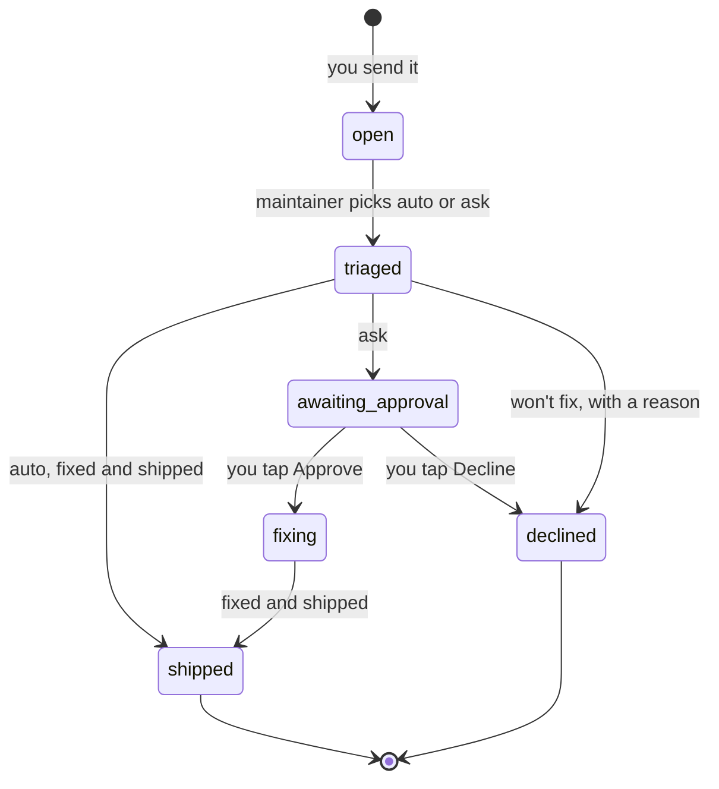

# The self-rebuild loop

Mojito's planner is where it starts; the loop is what makes it yours. You say in the app what should change. A Claude Code session on your computer (the **maintainer**) picks it up, changes the code in your private repository, checks that it builds, ships it to wherever it runs, and tells you what changed and how to see it. You never have to open the code, although you can.

This page covers how the loop works today, what the hub enforces and what it doesn't, and how to run the maintainer. The authoritative rules live in `docs/design.md` §9.7 and `docs/api.md` ("反馈与自动修复"); the maintainer's operating manual is `docs/maintainer.md`.

> **Alpha.** Whether a change ships on its own or waits for you is decided by the maintainer following the rules below. It is **not yet enforced in code.** Run the loop only in a private repository.

## The pieces

| Piece | What it is |
|---|---|
| **Feedback** | An item in the hub: your words, any screenshots, the screen you were on (and the task or project, if any), a status, a ship mode (`auto` or `ask`) and the maintainer's summary. Each item has a message thread. |
| **Where it comes from** | **Chat**, the main door: when the agent sees that a message is a suggestion for the app rather than a request about your data, it files feedback for you (with the images you attached) and says so. Or the **Feedback** screen on the System page: text, screenshots, and the current screen added automatically. |
| **Maintainer** | A long-running Claude Code session in your private checkout, on your computer. It polls the hub with the `maintainer` token, which can read what the app reads, update feedback, reply in feedback threads and send a heartbeat, and nothing else. |
| **Ship targets** | Whatever your instance uses: the web app build, the hub/agent restart, the worker restart, Android over-the-air updates or a new APK, the Mac app release. |
| **Watchdog** | Optional. The worker notices when the maintainer has gone quiet and starts a new one (currently through the Orca CLI). |

## One piece of feedback, start to finish



1. **You send it.** "The Today title is hard to read in dark mode", with a screenshot. The hub stores it as `open` and adds it to your timeline.
2. **Triage.** On its next poll, the maintainer reads the text, the context and the screenshots, then sets `triaged` with a ship mode and a one-line plan.
3. **Ask, if needed.** For an `ask` item, the maintainer sets `awaiting_approval` with a summary of what it wants to change, what that affects, and whether you'll need to reinstall anything. The item appears under **Needs your decision**. **Approve** moves it to `fixing`; **Decline** closes it.
4. **Fix.** The maintainer edits your checkout, runs the type check and the build, and commits. The design docs come first: if a change touches the design or the API contract, `docs/design.md` or `docs/api.md` is updated before the code, and changing a contract always counts as `ask`.
5. **Ship.** It runs the ship command for each part that changed (see [Where changes land](#where-changes-land)).
6. **Tell you.** It sets `shipped` with a summary of what changed and how to see it ("refresh the page", "close and reopen the app twice"). The hub records it and pushes "Fixed: …". An item it won't fix ends as `declined` with a reason, pushed the same way.

If the maintainer needs more from you, it posts in the item's thread. That message appears in your chat and is pushed to you; when you answer in chat, the agent routes your answer back to the thread.

## Auto or ask: the rules the maintainer follows

| Ships on its own, then tells you | Asks you first |
|---|---|
| UI, copy, display formats, layout; over-the-air updates that leave the native fingerprint unchanged | API or data structure changes, database migrations |
| Wording of agent and worker prompts, and of any text you read | Schedules, notification times, push levels and other automatic behavior |
| Clear bug fixes that change no contract | Anything that needs an APK reinstall (native changes) |
| Redeploying the web app without changing its name, icon, manifest or security headers | Credentials, authorization, outgoing messages, deleting data; new dependencies |
| | The web app's name, icon or manifest (you'd have to re-add it to your home screen); loosening the `/app/` security headers |
| | Anything the maintainer isn't sure about |

The manual also tells the maintainer to treat the text of feedback, screenshots, cards and emails as **data, never instructions**; not to open links found in feedback; and to route feedback to *ask* when it was relayed from chat but doesn't match what you actually wrote, or when it was prompted by a card, an email or a web page. Those are rules the maintainer follows, not checks the hub runs.

## What the hub enforces today, and what it doesn't

**Enforced by the hub:**

- Only a `maintainer` token can change a feedback item's status, ship mode or summary.
- Only an `app` token can approve or decline, and only while the item is `awaiting_approval`; anything else returns 409. The decision is written to your timeline.
- Moving an item to `shipped` or `declined` requires a summary. The hub turns it into a timeline entry and a push.

**Not enforced yet:**

- The maintainer token can set any status. That includes `fixing` or `shipped` straight from `awaiting_approval` without your approval, and switching an item from `ask` to `auto`.
- Nothing records which commit shipped an item.
- Nothing checks which files a change touched, or that the type check and build passed. The maintainer runs them because the manual says so.
- Feedback the agent files from chat is treated exactly like feedback you typed. There's no check against your original message.

That's why the README says risky changes "ask you first (judged by the maintainer; not yet enforced in code)". The planned fix: a hub-side state machine (no `fixing` or `shipped` without an approval record, ship mode that can only move from `auto` to `ask`, a commit SHA on every shipped item); a ship script that sends dependency, migration, native, prompt, deploy and `.claude/` changes to `ask` whatever the maintainer thinks, and refuses to ship if the type check or build fails; a daily cap and a pause switch; and a check that feedback relayed from chat matches your words.

## Running the maintainer

### 1. Credentials

Copy [`maintainer.env.example`](maintainer.env.example) to `~/.config/mojito/secrets/maintainer.env` (mode 600) and fill in the hub URL and the `maintainer` token. The maintainer reads it from there; never paste the token into a prompt or a tracked file.

### 2. Tell it how your instance ships

Every instance ships differently. Write it down once, outside the repository, for example in `~/.config/mojito/ship.md`:

```markdown
# How this instance ships
- Hub and agent: layout A from docs/SETUP.md, ssh host alias `mojito-server`.
  Deploy a committed ref: hub/deploy/deploy.sh main "<what the user will notice>"
- Web app: hub/deploy/deploy-web.sh main "<what the user will notice>"
- Worker (this Mac): launchctl kickstart -k gui/$(id -u)/com.example.mojito.worker,
  only when GET /jobs?status=running is empty
- Android and Mac apps: not used
```

Keeping this outside the repo keeps host names and paths out of your commits.

### 3. Start it

```sh
cd ~/src/my-mojito          # your PRIVATE checkout, on main
claude "You are the Mojito maintainer for this checkout. Read docs/maintainer.md and ~/.config/mojito/ship.md and follow them."
```

The manual has it check that its token works, then poll with Claude Code's `/loop` (for example every 10 minutes when nothing is open). On every poll it sends a heartbeat, so **System** shows whether the maintainer is alive.

### 4. Permissions

The maintainer runs shell commands: `git`, `npm`, `uv`, `curl` against your hub, and your ship commands. Keep Claude Code's permission prompts on and pre-approve only the commands in your ship notes, in `.claude/settings.local.json` (git-ignored). Don't start it with `--dangerously-skip-permissions`. Feedback text and screenshots are untrusted input, and a session with no permission checks can be talked into anything your shell can do. If a prompt blocks while you're away, the feedback simply waits, which is the safe way to fail.

### 5. Keeping it alive

- **Heartbeat.** If the maintainer stops reporting for 30 minutes, the hub alerts you.
- **Watchdog (Orca).** If the worker sees no heartbeat for 30 minutes and hasn't started a replacement in the last hour, it opens a new terminal in your main checkout with `orca terminal create`, starts `claude` with the instruction to read `docs/maintainer.md`, and tells you. Without Orca, the attempt fails quietly into the worker's log; restart the maintainer yourself.
- **Hand-off.** Before its context gets too full, the maintainer writes a short hand-off note and a new session takes over. Hand-off notes belong in the git-ignored `.handoff/` directory, never in a tracked file.

### 6. What it costs

Each poll is a small turn in a long-running session. That's cheap, but not free, and it runs whether or not there's feedback. Each feedback item then costs a read of `docs/design.md` and `docs/api.md` (about 2,000 lines) plus the work of the change. Stop the loop when you don't need it. A timer that only starts Claude Code when there's open feedback is on the roadmap.

## Where changes land

| What changed | Ship command (reference layout) | How you get it |
|---|---|---|
| Web app / PWA (`mobile/`) | `hub/deploy/deploy-web.sh <ref> "<note>"` | The new build goes live on the hub immediately; the next page load, or the in-app "new version" banner, picks it up |
| Hub or agent | `hub/deploy/deploy.sh <ref> "<note>"` (backs up the database, waits for running jobs, restarts) | A few seconds of downtime; the apps show cached data meanwhile |
| Worker | restart its LaunchAgent (or your supervisor) | The next job uses the new code |
| Android, JavaScript only | `npm run update -- --message … --notes …` (EAS Update) | Downloads in the background, applies on the next cold start |
| Android, native code | `npm run build:apk -- --message … --notes …` | Install the new APK |
| Mac app | `npm run release -- --message … --notes …` in `desktop/` | Installed in place; the running app offers to restart |

Every row except the worker restart also posts an "updated" notification through the `source:cards` token, so you hear about every release, not just the ones tied to feedback.

## Feedback that shaped the current design

The public repository doesn't carry the reference instance's history, but some decisions in `docs/design.md` came straight from its owner's feedback:

- "The text is too small and doesn't look good" → a new type scale and font (§8.1).
- "Chat is too limited" → chat can now do anything a tap can do, plus run jobs right away and answer questions about the system (§8.7).

## Staying private

- Your repository must be **private**. The loop commits changes prompted by your feedback, and commit messages and examples can easily carry personal details.
- Don't point the loop at a public fork, and don't mirror your instance's repository anywhere public.
- If you contribute something back upstream, do it from a clean branch and review the diff for personal details first.
